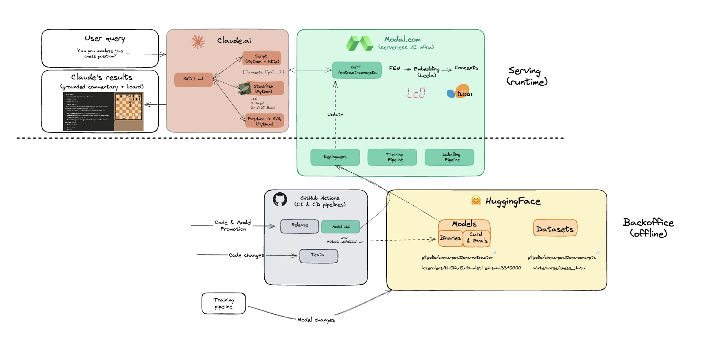

# chess-sandbox

This project implement research ideas for concept-grounded chess commentary with a focus on reproducibility, traceability and real world deployment prodived by modern open-source and cloud providers in the pyhton ecosystem.

## Architecture



[View/Edit diagram in Excalidraw](https://excalidraw.com/#room=281bb9f3e913a7cd6a7d,PVceQUonY0HTvcz6fcSLkQ)

### High-level

1. **Chess Commentary Skill** - A [Claude skill](https://www.claude.com/blog/skills) that enables a user to ask natural language query about a chess position (with FEN notation or game references like "Paul Morphy's Opera game") and an LLM to generate commentary grounded in position evaluation and chess concepts:
   - Chess engine evaluation and principal variations (Stockfish)
   - SVG visualization of positions
   - Concept extraction from a bespoke ML exposed via HTTP endpoint
2. **Extract-Concepts Endpoint** - Serverless [Modal.com](https://modal.com/) HTTP endpoint returning detected concepts and confidence scores from a ML classifier.
3. **Training Pipeline** - ML model training (local or Modal) for concept extraction:
   - Trained on [Leela Chess Zero (LC0)](https://lczero.org/) neural network activations
   - Logistic Regression classifiers using [scikit-learn](https://scikit-learn.org/)
4. **HuggingFace** - Centralized storage for datasets and trained models with associated model cards and evaluation metrics.
5. **CI/CD** - GitHub Actions for code quality checks and gated code/model updates.


### Detailled Tech Stack

**Core Components:**
- **Chess Engines:** [Stockfish](https://stockfishchess.org/) (position evaluation), [Leela Chess Zero](https://lczero.org/) (neural network activations)
- **ML Framework:** scikit-learn (Logistic Regression), [lczerolens](https://lczerolens.readthedocs.io/) (LC0 model interpretation)
- **LLM Integration:** Claude (via [Claude Skills](https://www.claude.com/blog/skills))
- **Serverless Deployment:** [Modal](https://modal.com/docs) - See [ADR](docs/adrs/20251029-use-modal-for-serverless-endpoints.md) for rationale
- **Model Hub:** [HuggingFace Hub](https://huggingface.co/) (datasets, models, metrics)

**Development:**
- **Package Management:** [uv](https://docs.astral.sh/uv/)
- **Type Safety:** Pydantic models, pyright (strict mode)
- **Code Quality:** ruff (format/lint), pytest (unit tests)
- **Chess Library:** [python-chess](https://python-chess.readthedocs.io/)
- **CI/CD:** GitHub Actions

Project scaffolding templated from [postmodern-python](https://github.com/carderne/postmodern-python)

### Project Structure

```
chess_sandbox/
├── config.py                  # Settings management
├── engine/                    # Chess engine wrappers (Stockfish, LC0)
│   ├── ...
├── concept_extraction/        # ML-based concept detection
│   ├── endpoints.py           # Modal HTTP endpoint for concept extraction
│   ├── model/                 # Model training and inference
│   │   ├── ...
│   └── labelling/             # Dataset creation (regex + LLM)
│       ├── ...
└── commentary/                # Experimental: OpenAI-based commentary
    └── ...

.claude/skills/chess-commentator/  # Claude skill for interactive analysis
    ├── skill.md               # Skill prompt and instructions
    └── scripts/               # Tools: engine analysis, SVG, concept extraction

docs/
├── adrs/                      # Architectural Decision Records
└── plans/                     # Implementation plans
```

## Future works

 * Human and LLM-as-Judge evaluation of generated chess commentaries using 
 * Data-centric improvements by collecting chess experts' feedback and annotations using https://prodi.gy/
 * ...

## Quick Start

### Prerequisites

- Python 3.13+
- [uv](https://docs.astral.sh/uv/) for dependency management
- [Stockfish](https://stockfishchess.org/download/) chess engine
- TOCLEAN:[Modal](https://modal.com/) account (serverless deployment and pipelines)
- TOCLEAN: [Huggingface](https://huggingface.co/) account (pulling datasets and models)
- OpenAI API key (optional, only for dataset creation with LLM validation)

### Setup

1. Install dependencies:
```bash
uv sync
```

2. Set environment variables:
```bash
cp .env.example .env

# Edit .env and set:
# STOCKFISH_PATH=/opt/homebrew/bin/stockfish  # macOS Homebrew
# OPENAI_API_KEY=your-api-key-here           # Optional: for dataset creation only
```

3. Run checks
```bash
uv run poe all
```

4. (Optional) Activate virtual environment to run commands using `python` instead of `uv run python`

```bash
source .venv/bin/activate
```

5. Locally run concept extraction (May require Huggingface account set-up, see TODO)

```bash
uv run python -m chess_sandbox.concept_extraction.model.inference predict "r2qk2r/p1p2p2/p2p1n1p/3Pp1p1/1P1bP3/P1N2QBP/2P2PP1/R4RK1 w kq - 2 15"
```

## Usage

### Interactive Commentary via Claude Skill

The `chess-commentator` skill provides interactive chess analysis in your conversation with Claude Code or Claude.AI:

**Example:**
```
> Analyze this chess position: 8/8/2K5/p1p5/P1P5/1k6/8/8 w - - 0 58
```

Claude automatically uses the skill to:
1. Run Stockfish analysis on the position
2. Extract tactical/strategic concepts via the ML endpoint
3. Generate an SVG visualization
4. Provide natural language commentary explaining best moves, key variations, and chess concepts

The skill is located in `.claude/skills/chess-commentator/` and triggers automatically when you provide FEN positions or reference specific games.

**Installation:**

TODO: package zip, following documentation

## Concept Extraction

### Inference

Locally running:
```bash
uv run python -m chess_sandbox.concept_extraction.model.inference predict "r2qk2r/p1p2p2/p2p1n1p/3Pp1p1/1P1bP3/P1N2QBP/2P2PP1/R4RK1 w kq - 2 15"
```

Or by querying the extract-concepts endpoint:

```bash
curl "https://pilipolio--chess-concept-extraction-extract-concepts.modal.run?fen=rnbqkbnr%2Fpppppppp%2F8%2F8%2F4P3%2F8%2FPPPP1PPP%2FRNBQKBNR+b+KQkq+e3+0+1&threshold=0.1"
```

Development mode (ephemeral deployment):
```bash
modal serve chess_sandbox/concept_extraction/endpoints.py

curl "https://pilipolio--chess-concept-extraction-extract-concepts-dev.modal.run?fen=..."
```

### Training the ML Model

The training pipeline extracts chess concepts from LC0 neural network activations using logistic regression classifiers (requires HF set-up)

**Local training:**
```bash
uv run python -m chess_sandbox.concept_extraction.model.train \
  --dataset-repo-id pilipolio/chess-positions-concepts \
  --lc0-model-repo-id lczerolens/maia-1500 \
  --layer-name block3/conv2/relu \
  --classifier-mode multi-label \
  --upload-to-hub --save-splits \
  --output-repo-id pilipolio/chess-positions-extractor \
  --n-jobs 4 --verbose 1
  --output-revision test_fixture

uv run python -m chess_sandbox.concept_extraction.model.evaluation evaluate \
  --classifier-model-repo-id pilipolio/chess-positions-extractor \
  --dataset-repo-id pilipolio/chess-positions-concepts \
  --dataset-filename test.jsonl \
  --sample-size 10
```

**Modal training (serverless):**

Requires Modal set-up with the `huggingface-read-write-secret` added to [secrets](https://modal.com/docs/guide/secrets):

```bash
modal run chess_sandbox/concept_extraction/model/modal_pipeline.py::train \
    --dataset-repo-id pilipolio/chess-positions-concepts \
    --lc0-model-repo-id lczerolens/maia-1500 \
    --classifier-mode multi-label \
    --upload-to-hub \
    --output-repo-id pilipolio/chess-positions-extractor
```

Detected concepts include tactical themes (pin, fork, skewer, sacrifice) and strategic themes (passed pawn, outpost, weak square, zugzwang). Models and datasets are versioned on [HuggingFace Hub](https://huggingface.co/pilipolio).

### Dataset Creation (Optional)

For creating new training datasets from annotated PGN files, see [docs/plans/concept-labelling-pipeline.md](docs/plans/concept-labelling-pipeline.md). This pipeline uses regex patterns and optional LLM validation to extract concepts from game annotations.


## Development

### Pre-commit Checks

Run all checks before committing:
```bash
uv run poe all
```

Individual commands:
```bash
uv run poe fmt     # ruff format
uv run poe lint    # ruff check --fix
uv run poe check   # pyright type checking
uv run poe test    # pytest (unit tests)
```

See `CLAUDE.md` for AI agent instructions and `pyproject.toml` for tool configurations.

## Deployment

### Modal Serverless Endpoints

The extract-concepts endpoint is deployed as a serverless HTTP endpoint on Modal. See [docs/adrs/20251029-use-modal-for-serverless-endpoints.md](docs/adrs/20251029-use-modal-for-serverless-endpoints.md) for architectural rationale.

**Prerequisites:**
1. Create account at https://modal.com
2. Generate API token at https://modal.com/settings/tokens
3. Authenticate: `modal token set --token-id <ID> --token-secret <SECRET>`

**Development deployment:**
```bash
modal serve chess_sandbox/concept_extraction/endpoints.py
# Access at: https://pilipolio--chess-concept-extraction-extract-concepts-dev.modal.run
```

**Production deployment:**

Automated via GitHub Actions on [releases](.github/workflows/release.yml). The production endpoint is available at:
```
https://pilipolio--chess-concept-extraction-extract-concepts.modal.run
```

### Docker (Integration Testing)

```bash
docker build -t chess-sandbox .
docker run --rm chess-sandbox /app/.venv/bin/python -m pytest -m integration -v
```

## CI/CD

GitHub Actions workflows:
- **PR Checks** ([.github/workflows/pr.yml](.github/workflows/pr.yml)): Formatting, linting, type checking, and unit/integration tests
- **Release** ([.github/workflows/release.yml](.github/workflows/release.yml)): Automatic Modal deployment on GitHub releases

## Bibliography and Resources

### Research Papers

- **Jhamtani & Hovy (2018)** - Learning to Generate Move-by-Move Commentary for Chess Games from Large-Scale Social Forum Data  
  - ACL 2018. Introduces a dataset of 298K chess move-commentary pairs and methods for generating move-by-move commentary. [Paper](https://www.cs.cmu.edu/~hovy/papers/18ACL-chess-commentary.pdf) | [ACL Anthology](https://aclanthology.org/P18-1154/)

- **ChessGPT (2023)** - Bridging Policy Learning and Language Modeling  
  - NeurIPS 2023. Integrates policy learning with language modeling for chess commentary generation. [arXiv:2306.09200](https://arxiv.org/abs/2306.09200) | [Code](https://github.com/waterhorse1/chessgpt)

- **Kim et al. (2025)** - Bridging the Gap between Expert and Language Models: Concept-guided Chess Commentary Generation and Evaluation  
  - NAACL 2025. Integrates expert models with LLMs through concept-guided explanations for accurate and fluent commentary generation. [arXiv:2410.20811](https://arxiv.org/abs/2410.20811) | [Code](https://github.com/ml-postech/concept-guided-chess-commentary)

- **Caissa-AI (2025)** - Neurosymbolic AI for Chess  
  - KI 2025 conference. Modern implementation using LangGraph and Prolog for chess commentary. [Paper](https://link.springer.com/chapter/10.1007/978-3-032-02813-6_11) | [Code](https://github.com/MazenS0liman/Caissa-AI)

### Chess Engines and Tools

- **Leela Chess Zero (lc0)** - Neural network-based chess engine  
  - [Website](https://lczero.org/) | [Repository](https://github.com/LeelaChessZero/lc0) | [Python wrapper](https://pypi.org/project/lcz/) | [JavaScript](https://github.com/frpays/lc0-js/)

- **Maia** - Human-like neural network chess engine  
  - Trained to predict human moves, providing "average" strength gameplay. [Repository](https://github.com/CSSLab/maia-chess) | [Website](https://www.maiachess.com/)

- **lczerolens** - Python library for interpreting lc0 models  
  - PyTorch-based tools for loading, manipulating, and probing lc0 neural network weights. [Repository](https://github.com/Xmaster6y/lczerolens) | [Documentation](https://lczerolens.readthedocs.io/) | [Report](https://hal.science/hal-05321380v1/file/Report-Exploring_capabilities_of_chess_playing_models_V1.pdf) | [Concept probing notebook](https://colab.research.google.com/github/Xmaster6y/lczerolens/blob/main/docs/source/notebooks/features/probe-concepts.ipynb)

### Datasets

- **Gameknot Games** - Social forum chess games  
  - Used in Jhamtani & Hovy (2018) for commentary generation. [Crawler](https://github.com/ml-postech/concept-guided-chess-commentary/tree/master/gameknot_crawler)

- **Annotated PGN Dataset** - Waterhorse chess data  
  - Large collection of annotated chess games from gameknot.com. [Dataset](https://huggingface.co/datasets/Waterhorse/chess_data) | [Download](https://huggingface.co/datasets/Waterhorse/chess_data/resolve/main/chessclip_data/annotated_pgn/annotated_pgn_free.tar.gz)

- **Kaggle Chess Commentary Dataset** - AI-generated commentaries  
  - [Dataset](https://www.kaggle.com/datasets/jayanthrajg/chess-commentary-dataset)

### Additional Resources

- **Awesome Explainable AI** - Curated resources on explainable AI  
  - [Repository](https://github.com/rushrukh/awesome-explainable-ai)

- **Fine-tuning Chess Commentary Models** - Medium article  
  - [Article](https://medium.com/@jasonyip_77999/fine-tuning-a-chess-commentary-model-d8ec8f44a022)

## License

MIT
