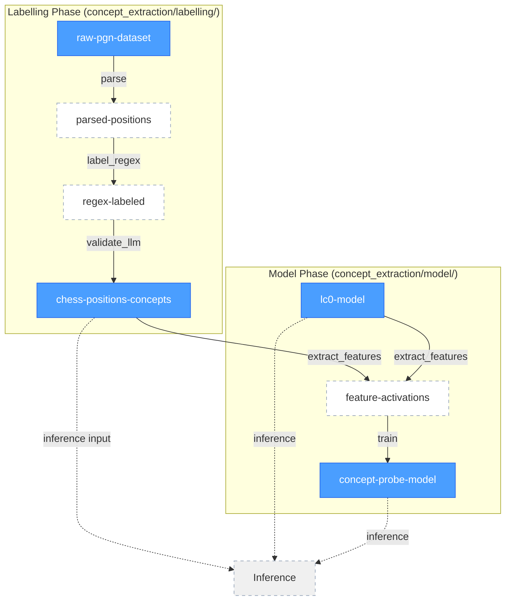

# Concept Extraction DAG with Hugging Face Versioning

## Overview

This document describes the end-to-end Directed Acyclic Graph (DAG) for the concept extraction pipeline, showing how data flows from raw chess games to trained concept probe models. Each transformation is represented as an edge (arrow), and each data artifact is represented as a node.

**Key Architectural Decision**: We distinguish between:
- **Versioned nodes**: Persistent artifacts stored in Hugging Face Hub with Git-based versioning
- **Transient nodes**: Ephemeral data that can be deterministically recomputed from versioned inputs

## DAG Visualization



**Legend:**
- **Solid blue boxes**: Versioned artifacts (HF Hub)
- **Dashed white boxes**: Transient data (recomputed on-demand)
- **Subgraphs**: Pipeline phases matching code structure

## Node Specifications

### Versioned Nodes (HF Hub Datasets/Models)

#### 1. `raw-pgn-dataset`
**Type**: HF Dataset
**Repository**: `Waterhorse/chess_data` (external) or `{HF_ORG}/chess-pgn-annotated`
**Format**: PGN files with text annotations
**Versioning**: Git commits, tags
**Size**: ~MBs per game collection
**Example**:
```
repo: pilipolio/chess-pgn-annotated
files: gameknot/*.pgn
version: main @ abc123
```

#### 2. `chess-positions-concepts`
**Type**: HF Dataset
**Repository**: `{HF_ORG}/chess-positions-concepts`
**Format**: JSONL (LabelledPosition with validated concepts)
**Schema**: Complete LabelledPosition with validated concepts:
```json
{
  "fen": "...",
  "previous_fen": "...",
  "move_san": "Nf3",
  "move_number": 1,
  "side_to_move": "white",
  "comment": "The bishop pins the knight to the king",
  "game_id": "gameknot_123",
  "concepts": [
    {
      "name": "pin",
      "validated_by": "llm",
      "temporal": "actual",
      "reasoning": "The bishop on b5 pins the knight to the king"
    }
  ]
}
```
**Versioning**: Dataset version + source PGN commit SHA
**Metadata**:
```yaml
source_dataset: Waterhorse/chess_data
source_revision: abc123
parser_version: v1.0.0
labeller_version: v1.0.0
patterns_version: v1.2.0
refiner_version: v1.0.0
llm_model: gpt-4o-mini
validation_date: 2025-11-03
concepts: [pin, fork, skewer, ...]
```

#### 3. `lc0-model`
**Type**: HF Model
**Repository**: `{HF_ORG}/lc0-maia-1500-onnx` or external
**Format**: ONNX
**Versioning**: Model version tag
**Size**: ~3.3MB (Maia-1500) to ~500MB (large networks)
**Metadata**:
```yaml
model_type: leela-chess-zero
training_source: maia-1500
format: onnx
input: 112 planes (8x8x112)
output: policy (1858) + value (1)
intermediate_layers: [block0/relu, block1/relu, ..., block3/conv2/relu]
```

**Available LC0 Networks**:
- **Maia-1500**: Small network (~3.3MB), currently used in codebase
- **T1 Medium (512x15x8h)**: Distilled medium network
  - Original: https://storage.lczero.org/files/networks-contrib/t1-512x15x8h-distilled-swa-3395000.pb.gz
  - ONNX: https://huggingface.co/lczerolens/t1-smolgen-512x15x8h-distilled-swa-3395000
  - Size: ~200MB, better positional understanding
- **Best Networks**: See https://lczero.org/dev/wiki/best-nets-for-lc0/ for latest recommendations

**Network Selection Considerations**:
- Larger networks provide richer features but slower extraction
- Maia networks are calibrated to human play strength
- T1 networks are distilled for efficiency
- Feature quality may vary by layer depth and network architecture

#### 4. `concept-probe-model`
**Type**: HF Model
**Repository**: `{HF_ORG}/chess-concept-probes`
**Format**: HF snapshot (joblib + metadata)
**Structure**:
```
probe_v1/
├── probe_model.joblib       # sklearn classifier
├── label_encoder.joblib      # Label encoder
├── config.json               # Quick-load config
├── probe_metadata.json       # Training metrics
└── README.md                 # Model card
```
**Versioning**: Semantic version tags (v1.0.0, v1.1.0)
**Metadata**:
```json
{
  "model_version": "v1.0.0",
  "lc0_model_repo": "pilipolio/lc0-maia-1500-onnx",
  "lc0_model_revision": "main",
  "training_dataset_repo": "pilipolio/chess-positions-concepts",
  "training_dataset_revision": "jkl012",
  "feature_layer": "block3/conv2/relu",
  "train_test_split": 0.8,
  "trained_at": "2025-11-03T10:30:00Z",
  "metrics": {
    "hamming_loss": 0.05,
    "exact_match": 0.82
  }
}
```

### Transient Nodes (Computed On-Demand)

#### 5. `parsed-positions`
**Type**: In-memory list of LabelledPosition objects
**Not Stored**: Computed from `raw-pgn-dataset`
**Format**: List of `LabelledPosition` objects (or JSONL for intermediate caching)
**Schema**:
```json
{
  "fen": "rnbqkbnr/pppppppp/8/8/8/8/PPPPPPPP/RNBQKBNR w KQkq - 0 1",
  "previous_fen": "...",
  "move_san": "e4",
  "move_number": 1,
  "side_to_move": "white",
  "comment": "Opening with king's pawn creates central control",
  "game_id": "gameknot_123",
  "concepts": []
}
```
**Rationale**:
- Deterministically reproducible from PGN files using python-chess
- Relatively fast to recompute (~1s per game)
- Parsing logic is simple and stable

**When to cache locally**:
- During active labeling development (save to `/tmp`)
- For iterative pattern tuning

**Never version because**:
- Can always be reproduced: `parse_pgn(raw_pgn@revision)`
- No added value over raw PGN until concepts are validated

#### 6. `regex-labeled`
**Type**: In-memory list of LabelledPosition objects with concepts
**Not Stored**: Computed from `parsed-positions`
**Format**: List of `LabelledPosition` objects with concepts
**Schema**:
```json
{
  "fen": "...",
  "comment": "The bishop pins the knight to the king",
  "concepts": [
    {
      "name": "pin",
      "validated_by": null,
      "temporal": null,
      "reasoning": null
    }
  ]
}
```
**Rationale**:
- Deterministically reproducible via regex patterns
- Very fast to recompute (~ms per position)
- Regex patterns are versioned in code (git)
- No manual annotation or expensive API calls

**When to cache locally**:
- During LLM validation development (save to `/tmp`)
- For batch LLM processing

**Never version because**:
- Can always be reproduced: `label_regex(parsed_positions, patterns@version)`
- LLM validation is the expensive step worth versioning
- Regex patterns are already versioned in source code

#### 7. `feature-activations`
**Type**: In-memory numpy arrays
**Not Stored**: Computed from `chess-positions-concepts` + `lc0-model`
**Format**: numpy array (N, 4096)
**Rationale**:
- Deterministically reproducible from versioned inputs
- Large storage footprint (4096 floats per position)
- Different feature layers may be needed for different experiments
- Quick to recompute (~100ms per position with batching)

**When to cache locally**:
- During active model development (save to `/tmp` or local cache)
- For large datasets to avoid repeated extraction

**Never version because**:
- Can always be reproduced: `extract_features(FEN, lc0_model@revision)`
- Tight coupling to specific layer choice (not reusable)
- Storage cost outweighs recomputation cost

## Edge Specifications (Transformations)

### 1. Parse: `raw-pgn-dataset` → `parsed-positions`
**Code**: `chess_sandbox.concept_extraction.labelling.parser`
**Function**: `parse_pgn_directory()`
**Logic**:
- Read PGN files with `python-chess`
- Extract mainline positions with comments
- Convert to `LabelledPosition` objects
- Keep in memory (not stored in HF Hub)

**Transient Output**: Not versioned

### 2. Label (Regex): `parsed-positions` → `regex-labeled`
**Code**: `chess_sandbox.concept_extraction.labelling.labeller`
**Function**: `label_positions()`
**Logic**:
- Apply regex patterns to comments
- Detect 12 chess concepts
- Add concepts to positions

**Transient Output**: Not versioned

### 3. Validate (LLM): `regex-labeled` → `chess-positions-concepts`
**Code**: `chess_sandbox.concept_extraction.labelling.refiner`
**Function**: `Refiner.refine()`
**Logic**:
- Send positions to LLM (gpt-4o-mini)
- Validate each concept individually
- Extract temporal context
- Add reasoning

**Provenance**:
```python
{
  "transformation": "parse_label_validate",
  "input_dataset": "Waterhorse/chess_data@abc123",
  "output_dataset": "pilipolio/chess-positions-concepts@jkl012",
  "parser_version": "v1.0.0",
  "labeller_version": "v1.0.0",
  "patterns_version": "v1.2.0",
  "refiner_version": "v1.0.0",
  "llm_model": "gpt-4o-mini",
  "llm_temperature": 0.0
}
```

### 4. Extract Features: `chess-positions-concepts` + `lc0-model` → `feature-activations`
**Code**: `chess_sandbox.concept_extraction.model.features`
**Function**: `extract_features_batch()`
**Logic**:
- Load LC0 ONNX model
- Register activation hooks
- Run inference on positions
- Extract intermediate layer activations
- Flatten to vectors

**Not Stored**: Computed on-demand during training/inference

### 5. Train: `feature-activations` → `concept-probe-model`
**Code**: `chess_sandbox.concept_extraction.model.train`
**Function**: `train()`
**Logic**:
- Load validated positions
- Extract features (transient)
- Train sklearn classifier
- Evaluate metrics
- Save in HF format
- Upload to Hub

**Provenance**:
```python
{
  "transformation": "train",
  "training_dataset": "pilipolio/chess-positions-concepts@jkl012",
  "lc0_model": "pilipolio/lc0-maia-1500-onnx@main",
  "output_model": "pilipolio/chess-concept-probes@v1.0.0",
  "hyperparameters": {
    "classifier": "LogisticRegression",
    "multi_label": true,
    "train_split": 0.8
  }
}
```

### 6. Inference: `concept-probe-model` + `lc0-model` + FEN → predictions
**Code**: `chess_sandbox.concept_extraction.model.inference`
**Function**: `ConceptExtractor.extract()`
**Logic**:
- Load probe from Hub
- Load LC0 model
- Extract features for input FEN (transient)
- Run probe prediction
- Return concepts with confidence

## Versioning Strategy

### Semantic Versioning for Models
- **Major**: Breaking API changes (different concept set)
- **Minor**: Backward-compatible improvements (better accuracy)
- **Patch**: Bug fixes (no training changes)

Example: `v1.2.3`

### Dataset Versioning
- **Git commits**: Automatic versioning via HF Hub
- **Tags**: Milestone versions (e.g., `v1.0-10k-positions`)
- **Branches**: Experimental variants (e.g., `only-tactics`, `grandmaster-only`)

### Provenance Tracking
Every versioned artifact includes:
1. **Source references**: Upstream dataset/model repo + revision
2. **Code version**: Git SHA or version tag of transformation code
3. **Timestamp**: Creation date
4. **Hyperparameters**: Configuration used for transformation

Example in dataset card for LLM-validated dataset:
```yaml
---
dataset_info:
  features:
    - name: fen
      dtype: string
    - name: concepts
      dtype: list
source:
  dataset: Waterhorse/chess_data
  revision: abc123def
  transformation: parse_label_validate
  parser_version: v1.0.0
  labeller_version: v1.0.0
  patterns_version: v1.2.0
  refiner_version: v1.0.0
  llm_model: gpt-4o-mini
  llm_temperature: 0.0
  created_at: 2025-11-03T10:00:00Z
---
```

## Technical Implementation Notes

### HF Hub vs. HF Datasets Library

**Current approach**: Using `huggingface-hub` library for simple dataset download/upload
- Lightweight: Direct file operations (JSONL upload/download)
- Simple: `hf_hub_download()`, `upload_file()`, `upload_folder()`
- Flexible: Works with any file format (JSONL, Parquet, CSV)
- Manual control: Explicit handling of provenance metadata

**Not using `datasets` library** (for now):
- `datasets` (https://pypi.org/project/datasets/) provides Apache Arrow backend with optimized preprocessing
- Useful for large-scale transformations, streaming, caching
- Tight integration with PyTorch/TensorFlow dataloaders
- More complex API and abstractions

**Migration path**:
- If/when we need:
  - Heavy preprocessing pipelines (map, filter, batch operations)
  - Memory-efficient streaming for large datasets
  - PyTorch DataLoader integration for neural training
  - Built-in data collators and batching
- Then migrate to `datasets` library with `load_dataset("pilipolio/chess-positions-concepts")`

**Current rationale**:
- Our datasets are small enough to fit in memory
- Preprocessing (parse, label, validate) happens offline
- sklearn training doesn't need dataloaders
- Simple JSONL read/write is sufficient

## Hugging Face Hub Repository Structure

```
Organization: pilipolio (or chess-concept-probes)

Datasets:
├── chess-pgn-annotated/                # Raw PGN files
│   ├── gameknot/*.pgn
│   ├── lichess/*.pgn
│   └── README.md
└── chess-positions-concepts/          # LLM-validated (only versioned dataset)
    ├── data/train.jsonl
    └── README.md

Models:
├── lc0-maia-1500-onnx/                 # LC0 model
│   ├── model.onnx
│   └── README.md
└── chess-concept-probes/               # Trained probes
    ├── v1.0.0/
    │   ├── probe_model.joblib
    │   ├── label_encoder.joblib
    │   ├── probe_metadata.json
    │   └── README.md
    ├── v1.1.0/
    └── README.md
```

## Incremental Update Patterns

### Adding New Data
1. **New PGN source**:
   - Upload to `chess-pgn-annotated/new_source/`
   - Run parse + label + validate pipeline (transient parsing and labeling)
   - Upload directly to `chess-positions-concepts` (new commit)
   - Train new probe model

2. **Improved labeling patterns**:
   - Update regex patterns in code (commit to git)
   - Re-run parse + label + validate on PGN source
   - Upload new version of `chess-positions-concepts`
   - Models can be retrained referencing new dataset version

3. **Re-validate existing positions**:
   - Download existing `chess-positions-concepts@old_version`
   - Re-run validation with updated LLM or prompts
   - Upload new version with updated validation metadata
   - Train new probe model

### Model Updates
1. **Retrain with more data**:
   - Reference newer dataset revision
   - Train and upload new model version
   - Metadata links to exact dataset used

2. **Hyperparameter tuning**:
   - Same dataset, different hyperparameters
   - Upload new model version with updated metadata

## Reproducibility Guarantees

Given:
- Dataset repo + revision: `pilipolio/chess-positions-concepts@jkl012`
- LC0 model repo + revision: `pilipolio/lc0-maia-1500-onnx@main`
- Training code version: `v1.0.0`
- Hyperparameters: `{train_split: 0.8, random_seed: 42}`

We can **exactly reproduce**:
- Feature activations (transient but deterministic)
- Trained probe model (sklearn with fixed seed)
- Evaluation metrics

## Benefits of This Architecture

1. **Traceability**: Every artifact links to its inputs
2. **Reproducibility**: All versioned inputs + code = reproducible outputs
3. **Storage Efficiency**: Don't store recomputable intermediates
4. **Collaboration**: Teams can share datasets and models via HF Hub
5. **Experimentation**: Easy to try different feature layers without storing all variants
6. **Incremental Updates**: Add data without reprocessing everything
7. **Model Lineage**: Track which data trained which model

## Implementation Priorities

### Phase 1: Dataset Upload Pipeline
- [ ] Upload LLM-validated positions to HF Hub (parse + label + validate combined)
- [ ] Generate dataset cards with full provenance metadata (PGN source → validated dataset)
- [ ] Add versioning for parser, labeller, and refiner code

### Phase 2: Model Training with HF References
- [ ] Update train.py to accept HF dataset references
- [ ] Extract features on-the-fly (no storage)
- [ ] Record full provenance in model metadata
- [ ] Upload to HF Hub with semantic versioning

### Phase 3: Inference with HF Hub
- [ ] Load datasets from HF Hub for evaluation
- [ ] Load models from HF Hub by version
- [ ] CLI accepts HF references instead of local paths

### Phase 4: Orchestration
- [ ] Pipeline DAG execution (e.g., with Prefect/Dagster/Modal)
- [ ] Automatic provenance tracking
- [ ] Incremental updates when upstream changes
